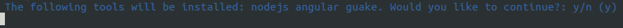
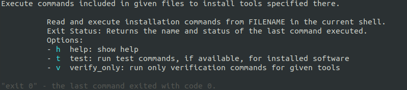
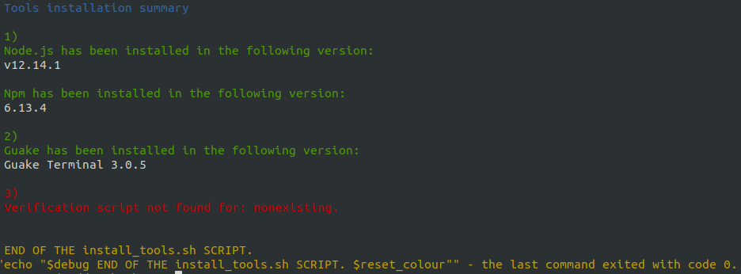

# ubuntu-web-dev-tools-installer


This project offers a bash script useful when you want to set up your development environment with only one command.

To learn details about this project, check out the [How to install development tools on Ubuntu with a single bash command](https://keepgrowing.in/tools/how-to-install-development-tools-on-ubuntu-with-a-single-bash-command/) post.

## Getting Started

To clone the repository, run in the command line:
```bash
$ git clone https://github.com/little-pinecone/ubuntu-web-dev-tools-installer.git
```

## Usage

To see all available options type the following command:
```
$ ./install.sh -h
```

To install tools, type the following command providing script file names as parameters:
```
$ sudo ./install.sh nodejs angular guake
```

You will be prompt to accept the installation:




To run only the verification scripts for provided tools run the following command:
```
$ ./install.sh -v nodejs angular guake
```

### Remember

* keep an eye on the order in which you install your tools - the script will install given tools in the same order as specified in parameters;
* before running installation scripts, the `apt update -y` command will be run automatically.

### Example

* Angular requires nodejs, therefore you should run the installation with the `$ sudo ./install.sh nodejs angular` command.
* You will get `permission denied` error if you run the script without `sudo`.

## Customization

You can add your own installation and verification scripts. Remember to keep commands regarding one tool in a separate `*.sh` file. Thanks to that, it will be easier to debug failures and retry installation.

### Remember:

* the installation script file name should clearly indicate what tools is being installed;
* the verification script file name should contain `_verify` suffix added to the same name as used in the installation file;
* put the scripts in the `scripts/tools/` directory.

### Example:

* installation script: `scripts/tools/angular.sh`
* verification script: `scripts/tools/angular_verify.sh` 

## Testing

__Requires [docker](https://docs.docker.com/install/linux/docker-ce/ubuntu/) to be already installed on your machine.__ Checkout `scirpts/tools/docker` and run `$ ./install.sh docker` if the script satisfies your needs.

The project contains `Dockerfile` and `docker-compose.yml` files to provide you with an Ubuntu18.04 instance where you can test the script. All `*.sh` files are already copied to the `/home` directory in the container.

* Start the container based on the provided image:
```
$ docker-compose up -d
```

* Enter the container:
```
$ docker exec -it ubuntuwebdevtoolsinstaller_test_1 /bin/bash
```

* List the directory content to see that you can access the `install.sh` file and the `scripts` directory:
```
/home # ls -la
total 16
drwxr-xr-x    1 root     root          4096 Jan 15 14:45 .
drwxr-xr-x    1 root     root          4096 Jan 15 14:46 ..
-rwxrwxr--    1 root     root          1129 Jan 15 13:21 install.sh
drwxr-xr-x    4 root     root          4096 Jan 15 14:45 scripts
```

> If you have changed the image, or any script that you intend to test there, remember to rebuild the image and remove the container with the following commands:
```
$ docker-compose build
$ docker container rm -f ubuntuwebdevtoolsinstaller_test_1
```
> Then you can create a new container and enter it:
```
$ docker-compose up -d
$ docker exec -it ubuntuwebdevtoolsinstaller_test_1 /bin/bash
```

## Troubleshooting

1. In case one installation script fails, you can call the command again after fixing the problem. Remember to remove those parameters that were successfully installed prior the failing tool.
2. Make sure that the `install.sh` script can be executed. If not, fix the permissions with the `chmod 744 install.sh` command

## Example screenshots

### Help command

```
$ ./install.sh -h
```



### Verification command

```
$ ./install.sh -v nodejs guake nonexisting
```




